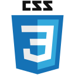
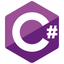
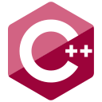

# Hi, I'm [Lory-Stan](https://stantanasi.github.io) 👋🏽

  
  
  
<a href="https://stantanasi.github.io">Portfolio 🛠</a>  

I'm a passionate self-taught developer from France.

### 🔨 Languages and Tools

  
  
  
  
  
  
  
  
  
  
  
  
  
  
  
  
  

### 📊 GitHub stats

