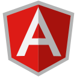

# Hey 👋🏽, I'm Lory-Stan

  <a title="Portfolio" href="https://stantanasi.github.io" target="_blank">
    <strong>Portfolio</strong>
  </a>
  ·
  <a title="Resume" href="https://docs.google.com/document/d/1lE_4oHBLQV5tKlT6t3OKqG20fIo8HiGoXfMDn7dER8M" target="_blank">
    <strong>Resume</strong>
  </a>

Welcome to my page! 
I'm Lory-Stan, a passionate mobile and web developer from **Paris, France**

### Connect with me:

### Languages and Tools:

### Support me:

---

  © 2024 Lory-Stan TANASI. All rights reserved

